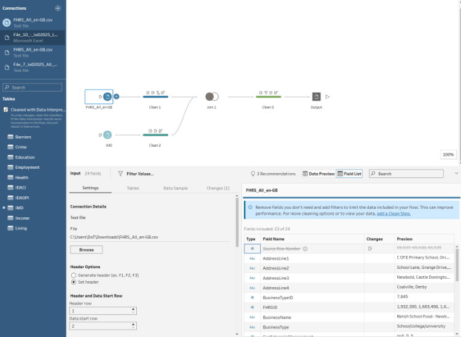
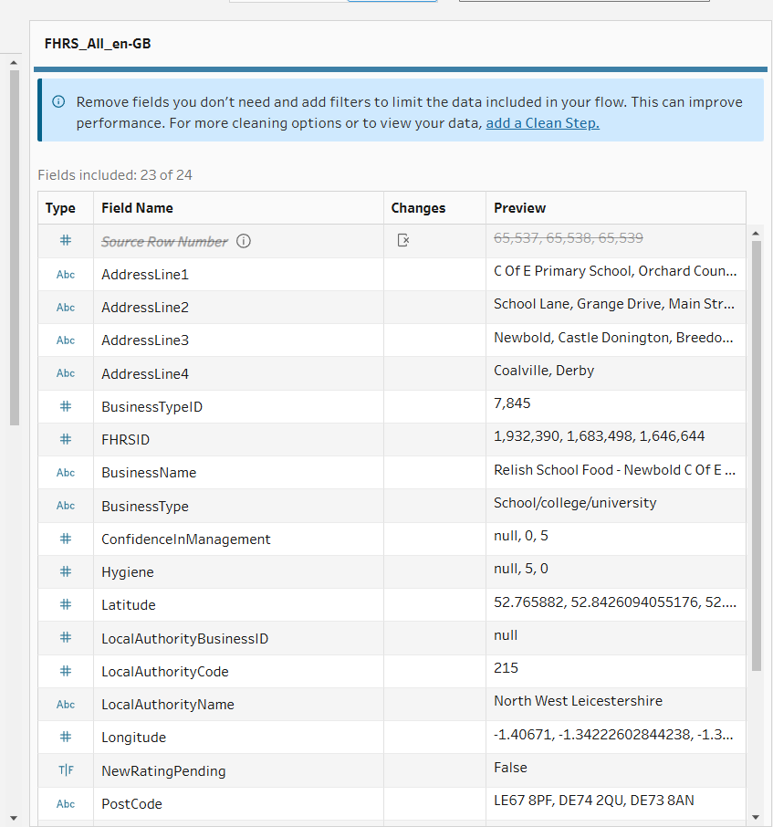
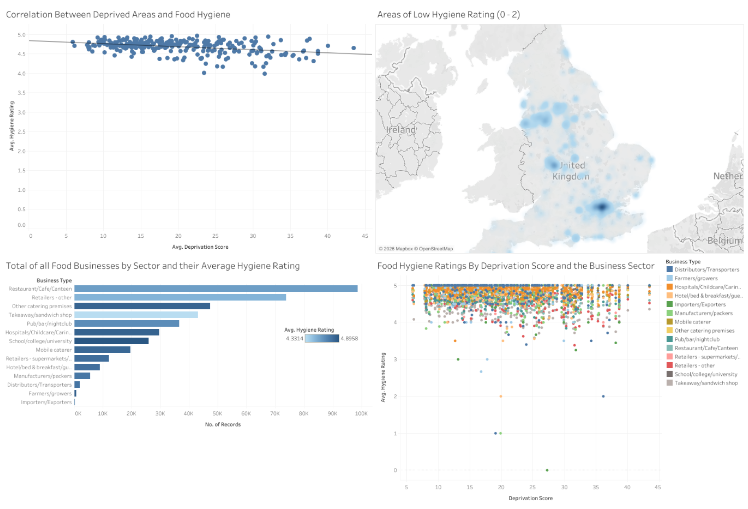
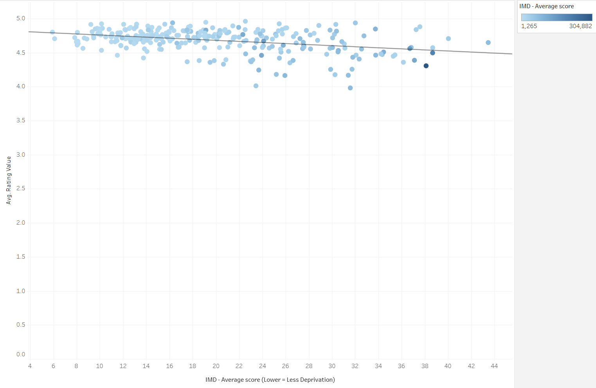
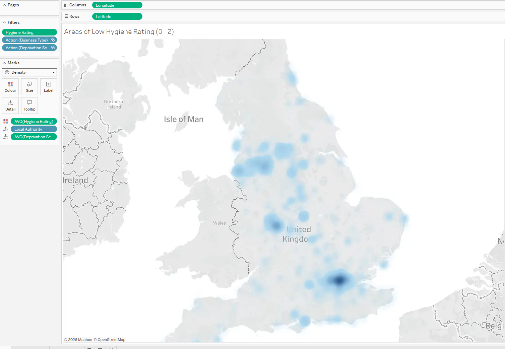
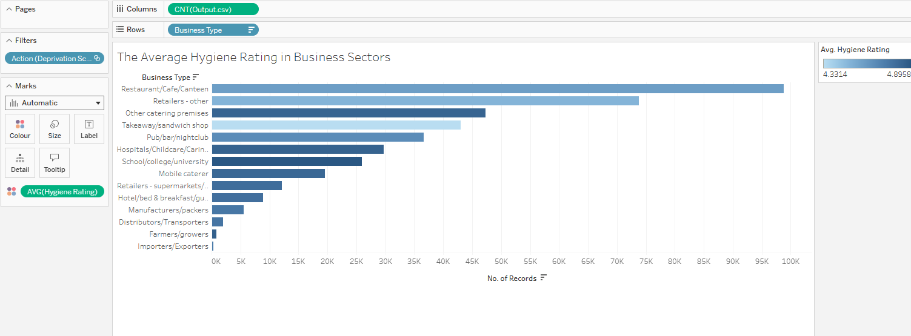
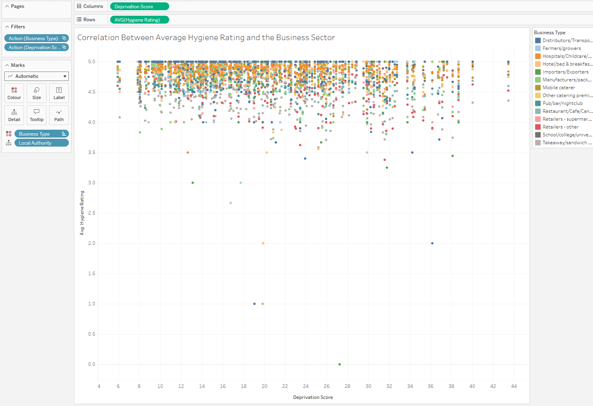

# Deprivation and Food Hygiene Analysis

This project explores whether there is a relationship between area deprivation and food-hygiene ratings across local-authority areas in England.

It was completed as part of my BSc (Hons) Computing studies at Abertay University. The project demonstrates a complete data-analysis workflow using Tableau Prep Builder and Tableau Cloud, from cleaning and joining raw datasets through to dashboard creation and interpretation.

## Project Aim

The aim was to investigate whether food-hygiene standards vary across areas with different levels of deprivation.

The analysis combines two public datasets:

- **Food Hygiene Rating Scheme (FHRS)** data
- **English Indices of Deprivation 2025** local-authority summaries

The FHRS dataset contains business-level inspection information, including business type, local authority, hygiene rating and structural score.

The deprivation dataset contains local-authority measures, including average deprivation score and average deprivation rank.

## Data Sources

- [Food Hygiene Rating Scheme open data](https://ratings.food.gov.uk/open-data)
- [English Indices of Deprivation 2025](https://www.gov.uk/government/collections/english-indices-of-deprivation)

## Data-Preparation Workflow

The data was processed using a repeatable Tableau Prep Builder workflow.

The workflow:

1. Loads the FHRS CSV file and deprivation spreadsheet
2. Cleans each dataset separately
3. Removes unnecessary fields
4. Converts hygiene ratings into a numeric format
5. Filters unusable records
6. Standardises local-authority names
7. Joins both datasets using local-authority information
8. Renames fields into a clearer format
9. Exports the cleaned dataset for use in Tableau Cloud

## Cleaning and Transformation

The FHRS dataset required additional preparation because some records contained text values, such as businesses awaiting inspection. These values could not be used when calculating average hygiene ratings and were filtered from the analysis.

Local-authority names also required cleaning because the two datasets did not always use the same naming format. Tableau calculated fields using functions such as `REGEXP_REPLACE` and `REPLACE` were used to remove punctuation and wording such as `City of`.

A left join was used with the FHRS dataset as the main table. This retained the food-hygiene records while attaching deprivation data where local-authority names matched.

## Processed Dataset

The final cleaned dataset contained more than **400,000 rows** and **12 fields**.

A small sample is available in this repository:

[`sample-data/output-sample.csv`](sample-data/output-sample.csv)

The complete output dataset is not included because it is significantly larger and is not required to demonstrate the workflow.

## Dashboard Overview

The processed data was analysed in Tableau Cloud using an interactive dashboard with filters for business type and deprivation score.

## Visualisations

### Deprivation and Average Hygiene Rating

The trend line suggests a slight negative relationship between deprivation score and average hygiene rating.

Areas with higher deprivation scores often had slightly lower average hygiene ratings. However, the spread of points shows that deprivation is not the only factor involved.

### Areas with Low Hygiene Ratings

The density map highlights geographic clusters of businesses with hygiene ratings between `0` and `2`.

### Comparison by Business Sector

Restaurants, cafes and canteens made up the largest business sector in the dataset.

Takeaway and sandwich shops had one of the lower average hygiene ratings, while schools, colleges and universities had one of the higher average ratings.

### Breakdown by Business Type

This scatter plot shows how average hygiene ratings vary across deprivation scores when split by business type.

It helps explore whether particular sectors appear to perform differently across local-authority areas.

## Key Findings

- The Tableau Prep workflow produced a cleaned dataset with more than 400,000 rows.
- The results suggest a slight negative relationship between deprivation score and average food-hygiene rating.
- The density map highlights geographic clusters of businesses with low hygiene ratings.
- Hygiene ratings vary between business sectors.
- Deprivation appears to be one relevant factor, but it does not fully explain differences in food-hygiene ratings.

## Tools and Skills Demonstrated

- Tableau Prep Builder
- Tableau Cloud
- Data cleaning and transformation
- Dataset joining
- Calculated fields
- Regular expressions
- Filtering and field renaming
- Interactive dashboards
- Scatter plots and trend lines
- Density maps
- Data visualisation
- Interpretation of patterns and limitations

## Repository Contents

| Folder | Contents |
|---|---|
| [`report`](report) | Written project report |
| [`screenshots`](screenshots) | Tableau workflow and dashboard screenshots |
| [`sample-data`](sample-data) | Small sample of the cleaned output dataset |
| [`exports`](exports) | Exported project visualisations |

## Full Report

A more detailed explanation of the workflow, visualisations and findings is available in the [project report](report/deprivation-food-hygiene-analysis-report.pdf).

## Limitations

- The analysis identifies patterns and relationships but does not prove that deprivation directly causes lower hygiene ratings.
- Deprivation was measured at local-authority level, which may hide differences between smaller neighbourhoods or streets.
- Some businesses could not be displayed on the map because latitude or longitude values were missing.
- The findings depend on the completeness and structure of the original public datasets.

## What I Learned

This project strengthened my understanding of data preparation, cleaning, dataset joining and dashboard design.

It also demonstrated the importance of interpreting visualisations carefully. A trend line can highlight a possible relationship, but the quality, granularity and limitations of the underlying data must still be considered.
